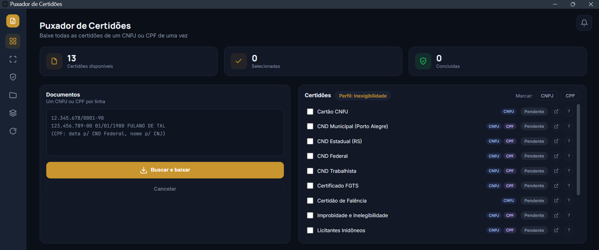

# Puxador de Certidões


Aplicativo desktop (Windows) que baixa, **de uma vez**, as certidões de um ou mais
CNPJ/CPF — renomeando cada arquivo com a data de validade e organizando por
documento. A interface abre em uma janela de aplicativo do **Edge do Windows**,
com tema claro/escuro e cor de destaque configurável.

> Este repositório contém **apenas a versão original em Python** (gratuita sempre
> que possível). A versão paga (API Infosimples), os executáveis e dados baixados
> **não** fazem parte do repositório.



## ⬇️ Baixar (pronto para usar)

Não precisa instalar nada nem programar: baixe o `.exe` mais recente na página de
**[Releases](../../releases/latest)** e é só abrir. Portátil, roda direto.

> Na primeira abertura ele leva alguns segundos para carregar (o executável se
> descompacta a cada início) — isso é normal.

## 📖 Manual

Guia ilustrado passo a passo (pensado para quem não é técnico), com a tela do
programa, como digitar os documentos, o que são as certidões manuais (captcha) e
onde ficam os arquivos:

**➡️ [Ver o tutorial](https://cainaogg.github.io/puxador-de-certidoes/)**

## 📄 Certidões suportadas

13 certidões, sempre organizadas na mesma pasta por empresa/pessoa. A maioria
aceita **CNPJ e CPF**; três são específicas de **Porto Alegre / Rio Grande do
Sul** — em outras cidades ou estados elas não vão funcionar.

| Certidão | Órgão | CNPJ | CPF | Abrangência |
|---|---|:---:|:---:|---|
| Cartão CNPJ | Receita Federal | ✅ | — | Nacional |
| **CND Municipal** | Prefeitura de **Porto Alegre** | ✅ | ✅ | ⚠️ Somente Porto Alegre |
| **CND Estadual** | SEFAZ-**RS** | ✅ | ✅ | ⚠️ Somente Rio Grande do Sul |
| CND Federal | Receita Federal / PGFN | ✅ | ✅ | Nacional |
| CND Trabalhista | TST (CNDT) | ✅ | ✅ | Nacional |
| Certificado FGTS | Caixa (CRF) | ✅ | ✅ | Nacional |
| Certidão de Falência | TJRS | ✅ | — | Regional por natureza (tribunal do RS) |
| Improbidade e Inelegibilidade | CNJ | ✅ | ✅ | Nacional |
| Licitantes Inidôneos | TCU (CEIS) | ✅ | ✅ | Nacional |
| Contas Julgadas Irregulares | TCU | ✅ | ✅ | Nacional |
| Consulta CEIS | CGU | ✅ | ✅ | Nacional |
| Consulta Consolidada | TCU | ✅ | — | Nacional |
| **Comprovante ISSQN** | Prefeitura de **Porto Alegre** | ✅ | ✅ | ⚠️ Somente Porto Alegre |

Vários órgãos bloqueiam automação (Receita, CNJ, TJRS, CEIS): nesses casos o
programa abre o site no navegador e só pede que você resolva o captcha — o
resto (encontrar, mover e renomear o arquivo) é automático.

## ❤️ Apoie o projeto

Se o programa te poupou tempo, um Pix é sempre bem-vindo (e opcional):
**[Contribuir via Pix](https://nubank.com.br/cobrar/5j8vr/6a5c2207-379e-4e6f-95b6-91fba4553914)**

## 🛠️ Rodar a partir do código

<details>
<summary><b>Preparação (uma vez)</b></summary>

Requer **Python 3.14+** no Windows. Depois de clonar, entre na pasta
`Projeto Original` e rode:

```
Preparar ambiente.bat
```

Esse script faz tudo: cria a venv, instala as dependências, **baixa a extensão
NopeCHA** (que resolve captchas) e o navegador do Playwright.

<details>
<summary>Ou manualmente (PowerShell)</summary>

```powershell
cd "Projeto Original"
python -m venv .venv
.\.venv\Scripts\Activate.ps1
pip install -r requirements.txt
python baixar_nopecha.py
python -m playwright install chromium
```
</details>
</details>

<details>
<summary><b>Rodar</b></summary>

Interface atual (janela de app do Edge):

```
interface_web\Ver interface nova (teste).bat
```

<details>
<summary>Interface clássica (CustomTkinter)</summary>

```
Iniciar.bat
```
(ou `.venv\Scripts\python.exe main.py`)
</details>
</details>

<details>
<summary><b>Gerar o executável (opcional)</b></summary>

```
interface_web\Gerar executavel (nova interface).bat
```

Gera um `.exe` portátil único em `dist\` (a interface nova, em modo-app do Edge).
Instala o PyInstaller se faltar e embute a NopeCHA automaticamente (se você já a
baixou). O `Gerar executavel.bat` da raiz ainda gera a interface clássica.
</details>

<details>
<summary><b>Estrutura do código</b></summary>

- `Projeto Original/certidoes/` — código (motor e um módulo por órgão; o motor é
  compartilhado pelas duas interfaces).
- `Projeto Original/interface_web/` — interface atual (HTML/CSS/JS + `main_web.py`,
  ponte via eel).
- `Projeto Original/assets/` — ícones (PNG) e a fonte Inter usados na interface.
- `Projeto Original/baixar_nopecha.py` — baixa a extensão de captcha.
- `Projeto Original/main.py` — ponto de entrada da interface clássica.
- `assets/icone.ico` — ícone do executável.
</details>

## ⚠️ Observações importantes

- **Token da API não está aqui.** O programa lê um `config.json` local (ignorado
  pelo Git). A versão original funciona sem token; ele só é usado no modo API.
- **Extensão NopeCHA** não é versionada (`vendor/`, ignorada), mas o
  `baixar_nopecha.py` (rodado pelo `Preparar ambiente.bat`) baixa a versão pública
  oficial dela. Sem a extensão o programa continua funcionando: o captcha vira
  assistido (você o resolve na janela do navegador). A versão gratuita da NopeCHA
  funciona sem nenhuma chave.
- Usa o **Edge/Chrome do sistema** para navegar; o Chromium do Playwright é só
  reserva.

## 👤 Autoria

Desenvolvido por **Cainã Gomes Süffert** — contato: caina@outlook.com
